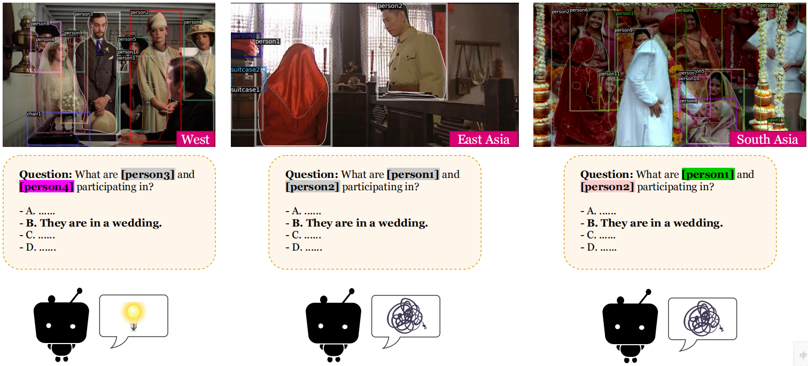

# GD-VCR
Code for *Broaden the Vision: Geo-Diverse Visual Commonsense Reasoning* (EMNLP 2021).

<p align="center">
    
</p>

## Research Questions and Aims:
1. How well can a model perform on the images which requires geo-diverse commonsense to understand?
2. What are the reasons behind performance disparity on Western and non-Western images?
3. We aim to broaden researchers' vision on a realistic issue existing all over the world, and call upon researchers to consider more inclusive commonsense knowledge and better model transferability on various cultures.

In this repo, GD-VCR dataset and codes about 1) general model evaluation, 2) detailed controlled experiments, and 3) dataset construction are provided.

## Repo Structure
```
GD-VCR
 ├─X_VCR				  --> storing GD-VCR/VCR data
 ├─configs
 │  └─vcr
 │     └─fine-tune-qa.json		  --> part of configs for evaluation
 ├─dataloaders
 │  └─vcr.py			          --> load GD-VCR/VCR data based on configs
 ├─models
 │  └─train.py		                  --> fine-tune/evaluate models
 │
 ├─val.jsonl			          --> GD-VCR dataset
 ├─val_addition_single.jsonl		  --> additional low-order QA pairs
```

## GD-VCR dataset
First download the original VCR dataset to `X_VCR`:
```
cd X_VCR
wget https://s3.us-west-2.amazonaws.com/ai2-rowanz/vcr1annots.zip
wget https://s3.us-west-2.amazonaws.com/ai2-rowanz/vcr1images.zip
unzip vcr1annots.zip
unzip vcr1images.zip
```

Then download the GD-VCR dataset to `X_VCR`:
```
cd X_VCR
mv val.jsonl orig_val.jsonl
wget https://gdvcr.s3.us-west-1.amazonaws.com/MC-VCR_sample.zip
unzip MC-VCR_sample.zip

cd ..
mv val.jsonl X_VCR/
mv val_addition_single.jsonl X_VCR/
```

The detailed items in our GD-VCR dataset are almost the same as VCR. Please refer to [VCR website](https://visualcommonsense.com/download/) for detailed explanations.

## VisualBERT

### Prepare Environment
Prepare environment as mentioned in the original repo of [VisualBERT](https://github.com/uclanlp/visualbert/tree/master/visualbert#dependencies).

### Fine-tune model on original VCR
Download the task-specific pre-trained checkpoint on original VCR [vcr_pre_train.th](https://drive.google.com/file/d/1iZ7QUv_jG6E6KNofO0jM5H9ee7nMEuYM/view?usp=sharing) to `GD-VCR/visualbert/trained_models`.

Then, use the command to fine-tune:
```
export PYTHONPATH=$PYTHONPATH:GD-VCR/visualbert/
export PYTHONPATH=$PYTHONPATH:GD-VCR/

cd GD-VCR/visualbert/models

CUDA_VISIBLE_DEVICES=0 python train.py -folder ../trained_models -config ../configs/vcr/fine-tune-qa.json
```
For convenience, we provide a trained checkpoint [[Link]](https://drive.google.com/file/d/1WWufTHpJpmmqDq3L2-QEYnDj7nEjszBP/view?usp=sharing) for quick evaluation.

### Evaluation on GD-VCR
```
CUDA_VISIBLE_DEVICES=0 python train.py -folder ../trained_models -config ../configs/vcr/eval.json \
        [-region REGION] \
        [-scene SCENE] \
        [-single_or_multiple SINGLE_OR_MULTIPLE] \
        [-orig_or_new ORIG_OR_NEW] \
	[-addition_annotation_analysis] \
        [-grounding]
```
Here are the explanations of several important attributions:
* `REGION`: One of the regions `west`, `east-asia`, `south-asia`, `africa`.
* `SCENE`: One of the scenario (e.g., `wedding`).
* `SINGLE_OR_MULTIPLE`: Whether studying `single`(low-order) or `multiple`(high-order) cognitive questions.
* `addition_annotation_analysis`: Whether studying GD-VCR or additional annotated questions. If yes, you can choose to set `SINGLE_OR_MULTIPLE` to specify which types of questions you want to investigate.
* `ORIG_OR_NEW`: Whether studying GD-VCR or original VCR dev set.
* `grounding`: Whether analyzing grounding results by visualizing attention weights.

Given our fine-tuned VisualBERT model above, the evaluation results are shown below:
<table>
  <tr>
    <th>Models</th>
	<th class="tg-0pky">Overall</th>
    <th class="tg-0pky">West</th>
    <th class="tg-0pky">South Asia</th>
    <th class="tg-0pky">East Asia</th>
    <th class="tg-0pky">Africa</th> 
  </tr>
  <tr>
    <td class="tg-0pky">VisualBERT</td>
	<td class="tg-0pky">53.27</td>
    <td class="tg-0pky">**62.91**</td>
    <td class="tg-0pky">52.04</td>
    <td class="tg-0pky">45.39</td>
    <td class="tg-0pky">51.85</td>
  </tr>
</table>

## ViLBERT

### Prepare Environment
Prepare environment as mentioned in the original repo of [ViLBERT](https://github.com/jiasenlu/vilbert_beta#repository-setup).

### Extract image features
We make use of the docker made for [LXMERT](https://github.com/airsplay/lxmert#feature-extraction-with-docker).
Detailed commands are shown below:
```
cd GD-VCR
git clone https://github.com/jiasenlu/bottom-up-attention.git
mv generate_tsv.py bottom-up-attention/tools
mv generate_tsv_gt.py bottom-up-attention/tools

docker pull airsplay/bottom-up-attention
docker run --name gd_vcr --runtime=nvidia -it -v /PATH/TO/:/PATH/TO/ airsplay/bottom-up-attention /bin/bash
[Used to enter into the docker]

cd /PATH/TO/GD-VCR/bottom-up-attention
pip install json_lines
pip install jsonlines
pip install python-dateutil==2.5.0

python ./tools/generate_tsv.py --cfg experiments/cfgs/faster_rcnn_end2end_resnet.yml --def models/vg/ResNet-101/faster_rcnn_end2end_final/test.prototxt --out ../vilbert_beta/feature/VCR/VCR_resnet101_faster_rcnn_genome.tsv --net data/faster_rcnn_models/resnet101_faster_rcnn_final.caffemodel --total_group 1 --group_id 0 --split VCR
python ./tools/generate_tsv_gt.py --cfg experiments/cfgs/faster_rcnn_end2end_resnet.yml --def models/vg/ResNet-101/faster_rcnn_end2end_final/test_gt.prototxt --out ../vilbert_beta/feature/VCR/VCR_gt_resnet101_faster_rcnn_genome.tsv --net data/faster_rcnn_models/resnet101_faster_rcnn_final.caffemodel --total_group 1 --group_id 0 --split VCR_gt
[Used to extract features]
```

Then, exit the dockerfile, and convert extracted features into lmdb form:
```
cd GD-VCR/vilbert_beta
python script/convert_lmdb_VCR.py
python script/convert_lmdb_VCR_gt.py
```

### Fine-tune model on original VCR
Download the pre-trained [checkpoint](https://drive.google.com/drive/folders/1JVM5WiolJJLnY9_lruxSaSop7IFX8a-v?usp=sharing) to `GD-VCR/vilbert_beta/save/bert_base_6_layer_6_connect_freeze_0/`.

Then, use the command to fine-tune:
```
cd GD-VCR/vilbert_beta
python -m torch.distributed.launch --nproc_per_node=8 --nnodes=1 --node_rank=0 train_tasks.py --bert_model bert-base-uncased --from_pretrained save/bert_base_6_layer_6_connect_freeze_0/pytorch_model_8.bin  --config_file config/bert_base_6layer_6conect.json  --learning_rate 2e-5 --num_workers 16 --tasks 1-2 --save_name pretrained
```
For convenience, we provide a trained checkpoint [[Link]](https://drive.google.com/file/d/19miEKsvBkY2FNsUkrabLwbJS3JRVKsBL/view?usp=sharing) for quick evaluation.

### Evaluation on GD-VCR
```
CUDA_VISIBLE_DEVICES=0,1 python eval_tasks.py 
		--bert_model bert-base-uncased 
		--from_pretrained save/VCR_Q-A-VCR_QA-R_bert_base_6layer_6conect-pretrained/vilbert_best.bin 
		--config_file config/bert_base_6layer_6conect.json --task 1 --split val  --batch_size 16
```
Note that if you want the results on original VCR dev set, you could directly change the "val_annotations_jsonpath" value of *TASK1* to `X_VCR/orig_val.jsonl`. 

Given our fine-tuned ViLBERT model above, the evaluation results are shown below:
<table>
  <tr>
    <th>Models</th>
	<th class="tg-0pky">Overall</th>
    <th class="tg-0pky">West</th>
    <th class="tg-0pky">South Asia</th>
    <th class="tg-0pky">East Asia</th>
    <th class="tg-0pky">Africa</th> 
  </tr>
  <tr>
    <td class="tg-0pky">ViLBERT</td>
	<td class="tg-0pky">58.47</td>
    <td class="tg-0pky">**65.82**</td>
    <td class="tg-0pky">62.90</td>
    <td class="tg-0pky">46.45</td>
    <td class="tg-0pky">62.04</td>
  </tr>
</table>

## Dataset Construction
Here we provide dataset construction methods in our paper: 
* `similarity.py`: Compute the similarity among answer candidates and distribute candidates to each annotated questions.
* `relevance_model.py`: Train a model to compute the relevance between question and answer.
* `question_cluster.py`: Infer question templates from original VCR dataset as the basis of annotation.

For sake of convenience, we provide the trained relevance computation model [[Link]](https://drive.google.com/file/d/1KyEqxy36wV2We43KOqFA7DSjiuXHc3vc/view?usp=sharing). 

## Acknowledgement
We thank for VisualBERT, ViLBERT, and Detectron authors' implementation. Also, we appreciate the effort of original VCR paper's author, and our work is highly influenced by VCR.

## Citation
Please cite our EMNLP paper if this repository inspired your work.
```
@inproceedings{yin2021broaden,
  title = {Broaden the Vision: Geo-Diverse Visual Commonsense Reasoning},
  author = {Yin, Da and Li, Liunian Harold and Hu, Ziniu and Peng, Nanyun and Chang, Kai-Wei},
  booktitle = {EMNLP},
  year = {2021}
}
```
